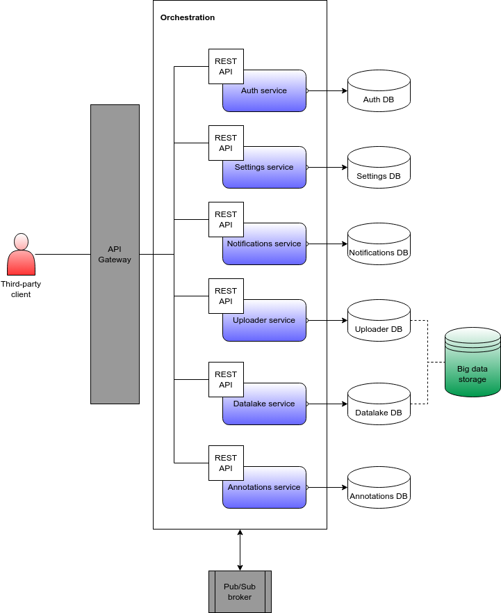
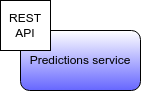

OWS es una arquitectura *multi-tenant* implementada bajo el patrón de diseño de microservicos, los cuales se comunican internamente (IPC) vía eventos.

## Estado del arte

A continuación, se presenta — de forma acotada — un diagrama que representa el estado actual de diseño de la composición de servicios de OWS; montados en un *cloud provider*.

Cada servicio expone una REST API las cuales se encuentran bajo el dominio `https://ostrichapi.com`.

### Servicio de predicciones

Como se comenta en la introducción, DeepAgro posee diversos modelos de computer vision — ya en producción. Estos, en la actualidad, son ejecutados de forma offline y en hardware específico como sucede con DeepAgro SprAI. 

En la actualidad, se está trabajando en un servicio web que pueda ejecutar estos modelos vía REST APIs: de esta forma, diferentes aplicaciones de terceros podrán hacer uso del conteo de plantas de maíz, detección de malezas en cultivos de soja y maíz, además de barbecho.

{ style="display: block; margin: 0 auto" }

### Tecnologías

Con respecto a tecnologías utilizadas, se pueden nombrar las que siguen:

- Python, para el desarrollo de servicios. En particular, [FastAPI](https://fastapi.tiangolo.com/).
- [Docker](https://docs.docker.com/) para el orquestrado de servicios.
- [Traefik](https://traefik.io/traefik/) como load balancer y gateway.
- [PostgreSQL](https://www.postgresql.org/) y [DynamoDB](https://aws.amazon.com/es/dynamodb/) para serialización de recursos lógicos.
- [S3](https://aws.amazon.com/s3/) para serialización de objetos, tales como imágenes y archivos temporales.
- [Redis](https://redis.io/docs/manual/pubsub/) como broker pub/sub para implementar IPC vía eventos.
- [OpenSearch](https://opensearch.org/) para el indexado de metadata de objetos y recuperación elástica de datos.
- [ZooKeeper](https://zookeeper.apache.org/) para centralizar la serialización de configuraciones globales de la arquitectura de servicios presentada.
